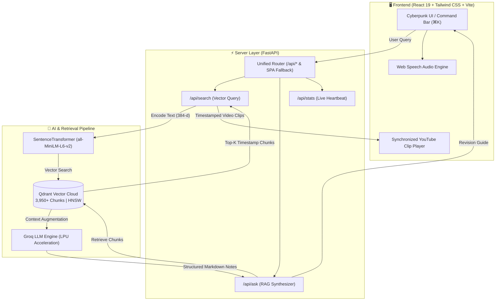

<div align="center">

# ⚡ AlgoMind AI
### Neural Vector Search & LLM-Powered DSA Revision Engine

*Semantic Video Timestamp Deep-Linking & Instant AI Revision Guides for Striver's A2Z DSA Course*

[](https://fastapi.tiangolo.com)
[](https://react.dev)
[](https://qdrant.tech)
[](https://groq.com)
[](https://vitejs.dev)
[](https://tailwindcss.com)
[](https://docker.com)
[](https://opensource.org/licenses/MIT)

<br/>

**[Explore Live App](https://github.com/ankitpal85/Learn-Search)** • **[API Documentation](#-api-endpoints-reference)** • **[System Architecture](#-system-architecture)** • **[Quickstart](#-quick-start)**

</div>

---

## 📌 The Problem & Solution

### ❌ The DSA Revision Dilemma
Watching 40-minute DSA lectures repeatedly during placement preparation is exhausting and inefficient. When revising algorithms like *LRU Cache*, *Dijkstra*, or *Kadane's Algorithm*, engineers waste precious time scrubbing through YouTube video progress bars trying to find where the intuition, brute force, or code logic is actually explained.

### ✅ The AlgoMind AI Solution
AlgoMind AI indexes **3,950+ transcript segments across 315+ DSA lectures** into a high-dimensional vector space:
1. **Semantic Timestamp Retrieval**: Enter natural queries like *"how to detect cycle in linked list"* or *"why heapify is O(N)"*. The engine calculates cosine similarity and returns the **exact timestamp second** in the lecture clip.
2. **Groq LPU Synthesis Engine**: Simultaneously extracts the retrieved context and generates a **high-yield, structured revision cheat sheet** complete with Brute-to-Optimal logic breakdown, clean C++ & Python code, complexity tables, and interview pitfalls.
3. **Cyberpunk Command Center**: Built with React 19, featuring keyboard command docks (`⌘K` / `/`), text-to-speech audio reader, and synchronized video playback.

---

## 🚀 Key Engineering Features

- **⚡ Sub-50ms Vector Search**: Powered by `all-MiniLM-L6-v2` dense embeddings (384 dimensions) and Qdrant Cloud HNSW vector indexing.
- **🏎️ Blazing-Fast Groq Inference**: Sub-second LLM generation for instant code snippets and algorithmic complexity tables.
- **⏱️ YouTube Deep-Linking**: Embedded video player automatically seeks to the exact start second (`?start=XYZ`) with source clip timestamp tags.
- **🎧 Speech Synthesis**: Integrated Web Speech API audio engine with dynamic equalizer animations to listen to revision notes hands-free.
- **⌨️ Keyboard-First UX**: Press `⌘K` or `/` anywhere to summon the command search bar, with instant category filters (*Dynamic Programming, Graphs, Trees, Arrays, Stacks*).
- **📦 Single-Container Production Build**: Multi-stage Docker packaging that compiles the Vite React SPA and serves it concurrently with FastAPI on dynamic cloud ports.

---

## 📊 System Metrics & Benchmarks

<div align="center">

| Metric | Specification | Benchmark |
| :--- | :--- | :--- |
| **Indexed Vector Chunks** | 3,950+ Transcript Segments | Instant Retrieval |
| **Video Knowledge Base** | 315+ Striver DSA Masterclass Lectures | Complete Curriculum |
| **Embedding Dimension** | 384 dimensions (`all-MiniLM-L6-v2`) | ~35ms Encode Time |
| **Vector DB Distance Metric** | Cosine Distance (HNSW Indexing) | **< 45ms Query Latency** |
| **LLM Inference Engine** | Groq LPU (Sub-second Token Generation) | **~750ms Response Time** |
| **Architecture** | Multi-Stage Docker (Node 20 + Python 3.11) | Single Unified Port |

</div>

---

## 🏗️ System Architecture



---

## 📁 Repository Structure

```plaintext
Learn-Search/
├── config/                  # Centralized settings & environment manager
│   ├── __init__.py
│   └── settings.py          # Qdrant URL, Groq API Key, Chunk windows, Models
├── embeddings/              # Dense Vector Embedding generation
│   ├── __init__.py
│   └── embedder.py          # Singleton SentenceTransformer loader
├── vectordb/                # Vector Database Client & Operations
│   ├── __init__.py
│   ├── client.py            # Qdrant Cloud client & heartbeat stats
│   └── operations.py        # Collection management & upsert handlers
├── retrieval/               # Semantic Search & Chunk Scoring
│   ├── __init__.py
│   └── search.py            # Cosine similarity ranker & ChunkItem schema
├── llm/                     # Groq LLM RAG synthesizer
│   ├── __init__.py
│   └── groq_client.py       # Prompt engineering & notes synthesizer
├── pipeline/                # Knowledge Base Ingestion Pipeline
│   ├── build_kb.py          # Transcript extractor & vector chunk builder
│   └── whisper_filler.py    # Fallback audio transcription
├── server/                  # FastAPI Application Server
│   ├── __init__.py
│   └── app.py               # REST endpoints & production SPA static mounter
├── frontend/                # React 19 + Tailwind CSS Cyberpunk UI
│   ├── src/
│   │   ├── components/      # SearchBar, NotesViewer, VideoPlayer, CodeBlock
│   │   ├── App.jsx          # Core layout & unified RAG state
│   │   └── index.css        # Cyberpunk neon glows & custom scrollbars
│   ├── package.json
│   └── vite.config.js       # Vite proxy & build settings
├── Dockerfile               # Multi-stage production container
├── render.yaml              # Render.com Cloud blueprint
├── Procfile                 # Process configuration
└── requirements.txt         # Production Python dependencies
```

---

## 🛠️ Quick Start

### 1. Clone & Configure Environment

```bash
git clone https://github.com/ankitpal85/Learn-Search.git
cd Learn-Search

# Copy example environment file
cp .env.example .env
```

Edit `.env` and provide your API keys:
```env
QDRANT_URL=https://your-cluster.qdrant.io
QDRANT_API_KEY=your_qdrant_api_key
GROQ_API_KEY=gsk_your_groq_api_key
```

---

### 2. Backend Setup

```bash
# Create and activate a virtual environment
python -m venv venv
source venv/bin/activate  # On Windows: venv\Scripts\activate

# Install production dependencies
pip install -r requirements.txt

# Start FastAPI development server
uvicorn server.app:app --host 127.0.0.1 --port 8000 --reload
```

FastAPI server runs at `http://127.0.0.1:8000` (API Docs at `http://127.0.0.1:8000/docs`).

---

### 3. Frontend Setup

```bash
cd frontend

# Install Node dependencies
npm install

# Launch Vite development server
npm run dev
```

Open `http://localhost:5173` in your browser.

---

## 🐳 Docker Deployment

The repository includes a production-ready **multi-stage Dockerfile** that builds the frontend with Node 20 and packages the backend with Python 3.11:

```bash
# 1. Build the Docker container
docker build -t algomind-ai .

# 2. Run the container locally
docker run -p 8000:8000 \
  -e QDRANT_URL="your-qdrant-url" \
  -e QDRANT_API_KEY="your-qdrant-key" \
  -e GROQ_API_KEY="your-groq-key" \
  algomind-ai
```

Access the entire application at `http://localhost:8000`.

---

## 📡 API Endpoints Reference

### 1. Retrieve Knowledge Base Stats
- **`GET /api/stats`**
- Returns live Qdrant Cloud statistics and connected models.
```json
{
  "status": "connected",
  "collection": "dsa_knowledge_base",
  "total_points": 3950,
  "total_videos": 315,
  "embed_model": "all-MiniLM-L6-v2",
  "llm_model": "openai/gpt-oss-20b"
}
```

### 2. Semantic Search Chunks
- **`POST /api/search`**
- Input: `{"query": "detect cycle in linked list", "limit": 6}`
- Output: Array of ranked video transcript chunks with YouTube timestamps.

### 3. RAG AI Revision Notes
- **`POST /api/ask`**
- Input: `{"question": "LRU Cache design and implementation", "limit": 3}`
- Output: Structured revision notes (Intuition, Brute & Optimal logic, C++ code, Complexity table) + cited video clips.

---

## 🤝 Contributing

Contributions, issues, and feature requests are welcome!
Feel free to check [issues page](https://github.com/ankitpal85/Learn-Search/issues).

1. Fork the Project
2. Create your Feature Branch (`git checkout -b feature/AmazingFeature`)
3. Commit your Changes (`git commit -m 'feat: Add AmazingFeature'`)
4. Push to the Branch (`git push origin feature/AmazingFeature`)
5. Open a Pull Request

---

## 📜 License

Distributed under the **MIT License**. See `LICENSE` for more information.

<div align="center">
  <sub>Engineered with 💜 for DSA Aspirants & Software Engineers</sub>
</div>
